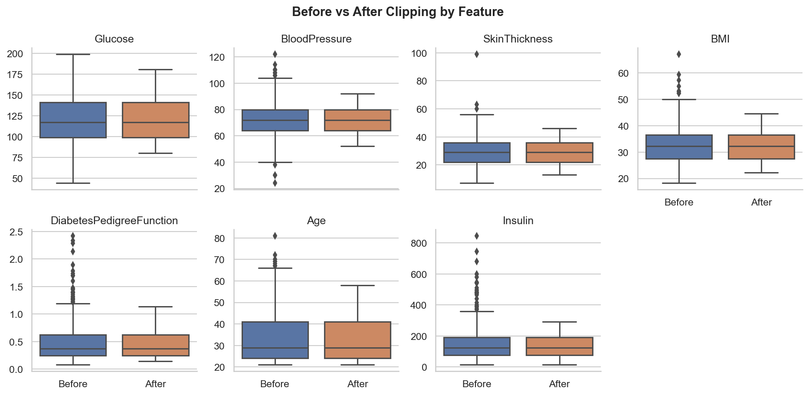
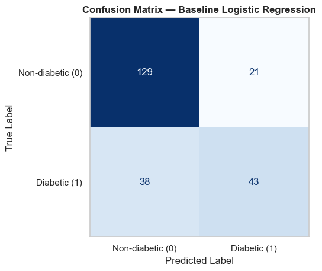
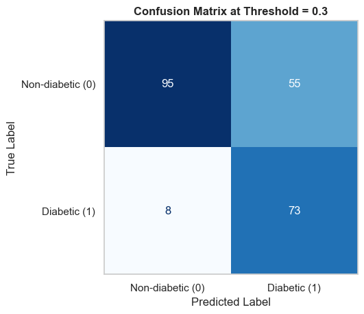
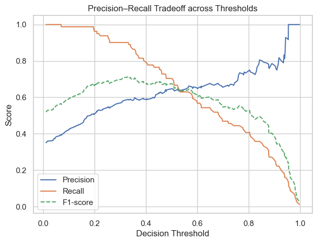
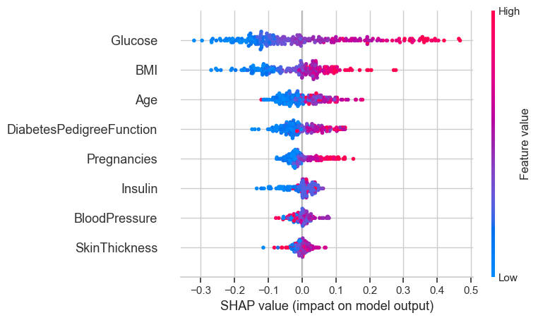
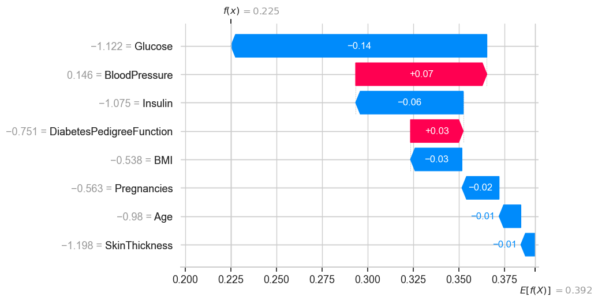

# 🩺 Diabetes Risk Prediction

## Project Overview
This project predicts diabetes risk using clinical data to support early screening decisions. It reflects my growth from data analyst to data scientist — integrating model development, tuning, and explainability to extract meaningful healthcare insights.

**Dataset**: [Pima Indians Diabetes Database](https://www.kaggle.com/datasets/uciml/pima-indians-diabetes-database)

## Objectives
Diabetes is often underdiagnosed until symptoms progress. The goal of this project is to identify high-risk individuals earlier through data-driven pre-screening. Because missing potential cases can delay treatment, **recall** was prioritized to minimize false negatives while maintaining acceptable precision.

## Workflow Summary
- The modeling process began with a baseline **Logistic Regression** and an **ensemble model** without oversampling. Since recall showed little improvement (0.53 → 0.54), **SMOTE** was applied to address class imbalance.  
- After retraining with SMOTE, recall increased to 0.70 while AUC remained stable (~0.84).  
- Further **threshold tuning (0.5 → 0.4 → 0.35 → 0.30)** identified **0.30** as the optimal decision point — maximizing recall (0.90) and F1-score (0.70) with minimal precision loss.  
- This final threshold balances medical sensitivity and model reliability for pre-screening use.

## Key Results
- The final model achieved **Recall = 0.90** and **ROC-AUC = 0.84**, showing strong sensitivity and stable discriminative power.  
- While precision decreased slightly (0.57), this trade-off reduced false negatives to only 10% — a crucial improvement in a clinical screening context.  
- These results demonstrate how model calibration can align machine learning with healthcare priorities.

## Explainability (SHAP Insights)
- SHAP analysis revealed **Glucose, BMI, Age, and Insulin** as the most influential features.  
High glucose and BMI values consistently increased diabetes probability, aligning with medical evidence.  
- This interpretability not only enhances transparency but also validates that the model’s reasoning matches clinical logic.

## Visual Highlights

### 1. Outlier Handling — Before vs After Clipping
Comparing feature distributions before and after percentile-based clipping shows how extreme values were stabilized for model robustness.
  


---

### 2. Model Performance — From Baseline to SMOTE + Threshold Tuning
- The baseline logistic regression model showed limited sensitivity, missing several diabetic cases.  
- After applying **SMOTE** for class balance and **threshold tuning (0.5 → 0.3)** for recall optimization,  
the model captured **88% of diabetic patients** while maintaining an ROC-AUC around **0.84**.

| Baseline Logistic Regression | Final Model (SMOTE + Threshold 0.30) | Precision Recall Tradeoff |
|--------------|----------------|----------------|
|  |  |  |


---

### 3. Model Explainability — SHAP Insights
- The SHAP summary highlights **Glucose**, **BMI**, and **Age** as dominant predictors of diabetes risk.  
- The waterfall plot below shows how individual features influence one patient’s prediction.

| Global Importance | Local Explanation |
|--------------------|--------------------|
|  |  |


## Key Takeaways & Future Work
- I built an end-to-end classification pipeline that prioritizes recall and interpretability — key elements for healthcare AI.
- Through this project, I learned to evaluate models beyond accuracy, focusing on decision thresholds and explainability.
- Future improvements may include integrating more demographic data and deploying the model as a web-based screening tool.

## Tech Stack
Python | Pandas • NumPy • Scikit-learn | Matplotlib • Seaborn | SHAP (Explainable AI)  

## How to Run
Clone the repository and install dependencies:
```bash
git clone https://github.com/Hyeri-Jerrie-Kim/supervised-learning.git
cd diabetes-risk-prediction

pip install -r requirements.txt
```
Run the notebook:
```bash
jupyter notebook notebooks/diabetes_risk_prediction.ipynb
```

## 📬 Contact Me

Hyeri Kim — 📧 [Email](mailto:hyeri5524@gmail.com) | 🌐 [LinkedIn](https://linkedin.com/in/hyerikim-ds)   
